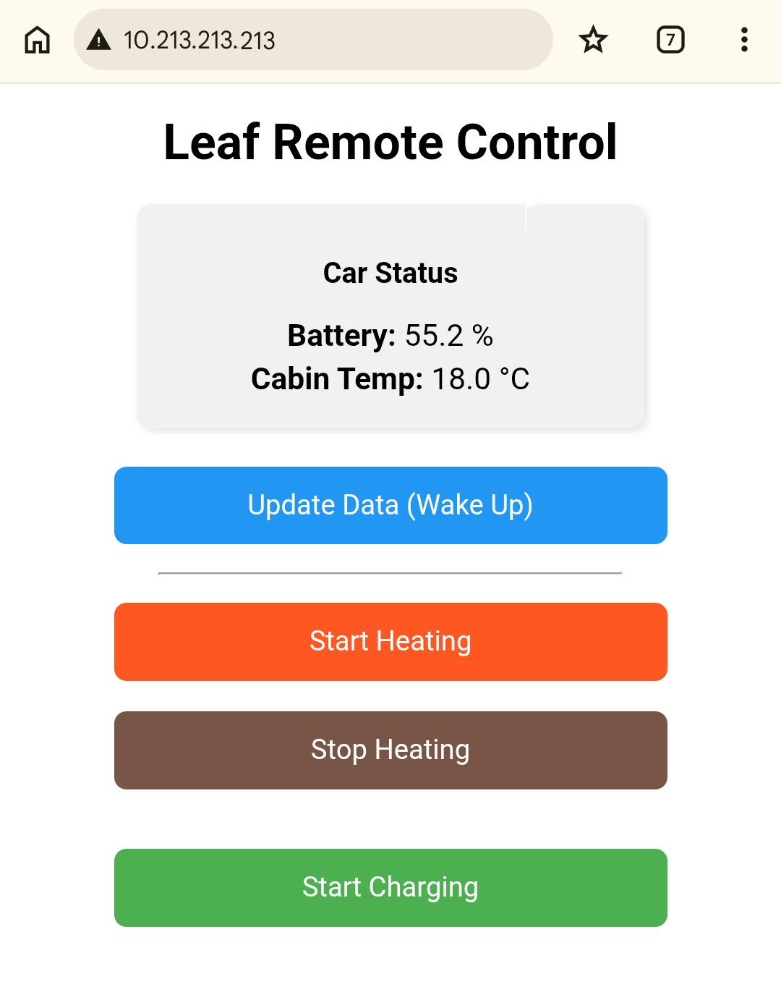

# simppeliTCU 🍃
**A lightweight, open-source DIY replacement for the Nissan Leaf ZE1 Telematics Control Unit (TCU).**

*Read this in Finnish: [README_FI.md](README_FI.md)*

With Nissan shutting down the NissanConnect EV services, `simppeliTCU` offers a local, Wi-Fi-based ESP32 solution to regain control of your car's climate and charging via the IT CAN bus (often referred to as CAR-CAN by the community). Similarly as the original TCU.

NOTE: This project is currently an draft implementation generated mainly with AI.

## Features
* 🌡️ **Remote Climate Control:** Start and active abort of the cabin heater/AC.
* 🔋 **Remote Charging:** Override the charge timer to start charging.
* 📊 **Live Data:** Reads State of Charge (SOC %) and Cabin Temperature from the CAN bus.
* 🌐 **Web UI:** Simple, lightweight mobile-friendly web interface.

## Hardware Requirements
1. **Lilygo T-2CAN** (ESP32 with built-in CAN transceiver).
2. **Automotive 12V to 5V Step-Down Converter** (Highly recommended: a flush-mount 12V USB car socket).
3. Connectors/pins to mate with the original TCU harness.

### ⚠️ CRITICAL WIRING WARNING
**DO NOT connect the car's 12V line directly to the Lilygo board!** Automotive 12V systems experience massive voltage spikes (transients) that will most likely damage the ESP32. 
* Unplug the IT-CAN wires from original TCU.
* Route the 12V from the TCU harness through an automotive-grade 12V-to-5V USB adapter (with an inline fuse).
* Power the Lilygo using a standard USB cable from the adapter.
* Connect `CAN-H` and `CAN-L` to the Lilygo's TWAI pins (Port B: TX 7, RX 6 in this code).

## The CAN Magic (Discoveries)
This project utilizes the `IT-CAN` bus (often referred to as CAR-CAN by the community). While climate commands are somewhat known, this project also maps the previously undocumented remote charging sequences for the ZE1:

* **Wakeup Ping:** `ID: 0x68C | Len: 1 | Data: 00` TCU seems to be calling this about 65 times to wake others u
* **Wakeup command:** `0x601 | Len: 2 | Data: 83 C0` Seen once and then the wakeup pinging stops after one last message.
* **TCU Command ID:** `0x56E | Len: 4`
  * **Init/Prepare:** `46 08 00 00` First CU message after the wakeup calls
  * **Sleep:** `86 00 00 00` Last 0x56E message when done and shortly after the IT-CAN goes quiet.
  * **Climate ON:** `4E 08 00 00`  
  * **Climate ABORT (Force Stop):** Sequence starting with `96 00 00 00`
  * **Climate OFF:** `56 08 00 00` Explicit deactivation, sent after Climate ABORT in the shutdown sequence. (`0x46` Init with bit 4 set)
  * **Charge ON:** `66 08 00 00` Called instead of Init/Prepare `46` but with one bit (0x20) being set

## Known Limitations / Research
* **Sleep (charging):** `A6 00 00 00` Captured what appears to be variant of 0x86, not sure if this was error related (charging did not start this time) or always used at end of every charge start sequence.

## License & Disclaimer (MIT License)
This project is licensed under the MIT License. 

**DISCLAIMER OF LIABILITY:**
This software and hardware modification interacts with the high-voltage control systems of a vehicle. It is provided "AS IS", without warranty of any kind, express or implied. By using this code, you assume all risks. The authors or contributors will NOT be held liable for any damage to your vehicle, voided warranties, property damage, or personal injury resulting from the use of this software or hardware. **USE AT YOUR OWN RISK.**

## Credits
* Inspired by the incredible work of the [OVMS Project](https://github.com/openvehicles/Open-Vehicle-Monitoring-System-3) and [Dalathegreat](https://github.com/dalathegreat) (Dala's EV Repair) for documenting the Nissan Leaf CAN buses.