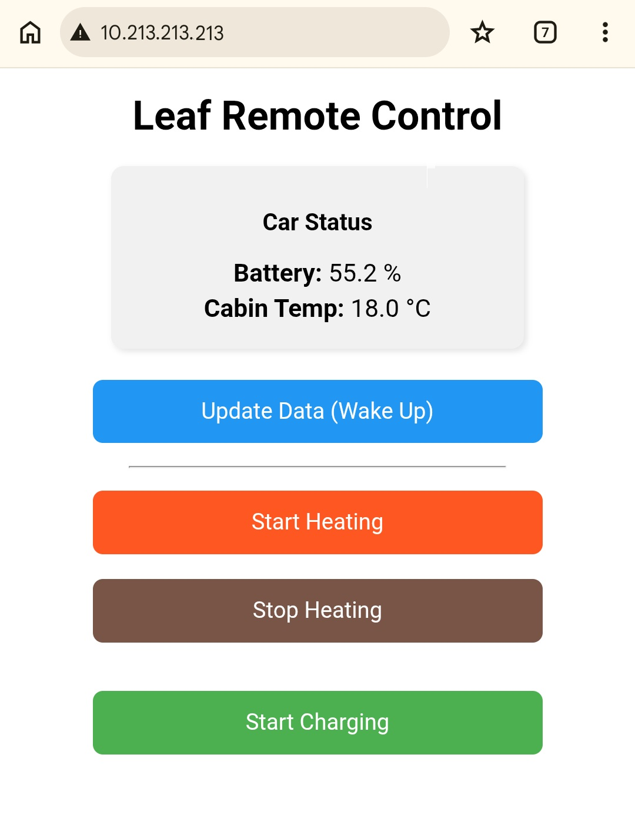

# simppeliTCU 🍃
**Kevyt ja avoin tee-se-itse-korvaaja Nissan Leaf ZE1:n alkuperäiselle etäohjaukselle (TCU).**

*Lue tämä englanniksi: [README.md](README.md)*

Kun Nissanin alkuperäiset pilvipalvelut lakkaavat toimimasta tai muuttuvat epäluotettaviksi, `simppeliTCU` palauttaa autosi hallinnan omiin käsiisi. Tämä ESP32-pohjainen laite kytkeytyy suoraan auton IT CAN -väylään (yhteisössä usein tunnettu nimellä CAR-CAN) kuten alkuperäinen TCU ja tarjoaa helpon Wi-Fi-käyttöliittymän.

Huomio! Projekti on hahmotelmavaiheessa ja koodit on suurelta osin generoitu tekoälyn avulla.

## Ominaisuudet
* 🌡️ **Lämmityksen etäohjaus:** Ilmastoinnin/lämmityksen käynnistys ja välitön pakkosammutus.
* 🔋 **Latauksen etäohjaus:** Latausajastimen ohitus (latauksen aloitus).
* 🔐 **Ovien lukitus:** Lukitse ja avaa ovet etänä (oletuksena pois päältä, kytke päälle asetuksista).
* 📊 **Auton tila:** Lukee väylältä akun tarkan varausprosentin (SOC) ja sisälämpötilan.
* 🌐 **Web-käyttöliittymä:** Toimii suoraan puhelimen selaimella, yksinkertainen ja kevyt.
* 🏠 **Home Assistant -integraatio:** Automaattinen laitteen tunnistus MQTT:n kautta.
* 📡 **MQTT-tuki:** Integrointi kotiautomaatioon tai mobiilisovelluksiin salatun yhteyden yli. Huom: MQTT-palvelinta ei todenneta, ellei kunnollista varmenteen tarkistusta ole toteutettu. Katso [MQTT-asennusohje](docs/mqtt.md).

## Toiminta
* ⚙️ **Uusi komento ei keskeytä aloitettua:** Laite käsittelee CAN-komennot asynkronisesti. Jos uusi komento annetaan edellisen ollessa vielä kesken, uusi komento ohitetaan turvallisesti.



## Videot
* **Ensimmäiset testit:** [https://youtu.be/qn05-901b3Y](https://youtu.be/qn05-901b3Y)
* **Web-käyttöliittymä Wi-Fin kautta:** [https://youtube.com/shorts/XqAgwizNodE](https://youtube.com/shorts/XqAgwizNodE)
* **MQTT-käyttö IoTMQTTPanelilla ja OVMS Connectilla:** [https://youtu.be/g8Yh6OgjL-Q?si=QtElrzG9FnF5YEUm](https://youtu.be/g8Yh6OgjL-Q?si=QtElrzG9FnF5YEUm)
* **Hansikaslokeron irrotus (LHD ZE1 Leaf):** [https://youtu.be/kyx2A4U-M1M?si=YGewj1TeBEfrpOKV](https://youtu.be/kyx2A4U-M1M?si=YGewj1TeBEfrpOKV)

## Laitteistovaatimukset
1. **Lilygo T-2CAN** (ESP32-mikrokontrolleri sisäänrakennetulla CAN-piirillä).
2. **12V -> 5V autokäyttöön tarkoitettu jännitteenalennin** (Vahva suositus: upotettava 12V USB-autopistorasia).
3. Pinnit/liittimet alkuperäisen TCU-johdon päähän.

**Katso [Asennusohje (ENG)](docs/INSTALLATION.md) saadaksesi vaiheittaiset asennusohjeet, kytkentäkaaviot ja tarvittavat työkalut.**

### ⚠️ TÄRKEÄ VAROITUS VIRRANSYÖTÖSTÄ
**ÄLÄ kytke auton 12V-linjaa suoraan Lilygo-levyyn!** Auton sähköjärjestelmän jännitepiikit todennäköisesti rikkovat laitteen.
* Irrota alkuperäinen TCU IT-CAN-väylästä.
* Ota 12V-virta TCU:n liittimestä ja vie se autokäyttöön tarkoitetun 12V USB-pistorasian (ja sulakkeen) läpi.
* Syötä Lilygolle virta tavallisella USB-kaapelilla rasiasta.
* Kytke `CAN-H` ja `CAN-L` Lilygon TWAI-pinneihin (Port B: tässä koodissa TX 7, RX 6).

## Asetukset

Laitteen asetukset (Wi-Fi, MQTT-tunnukset jne.) tallennetaan pysyväismuistiin. Voit määrittää järjestelmän USB-sarjaliitännän kautta käyttämällä pääteohjelmaa (kuten Arduino IDE:n Serial Monitor, PuTTY tai vastaava), jonka nopeudeksi on asetettu **115200 baudia** ja rivinvaihto (Newline, `\n`) tai palautus (Carriage Return, `\r`) on käytössä.

Käytettävissä olevat komennot:
* `list` - Näyttää kaikki nykyiset asetukset.
* `get <avain>` - Tulostaa määritetyn avaimen nykyisen arvon.
* `set <avain> <arvo>` - Päivittää määritettyyn avaimeen uuden arvon (tallentuu pysyvästi).
* `reboot` - Käynnistää laitteen uudelleen, jotta muutokset tulevat voimaan välittömästi.
* `factory-reset` - Tyhjentää kaikki asetukset ja käynnistää laitteen uudelleen.

**Esimerkki asetusistunnosta:**
```text
set ssid OmaWiFiVerkko
set password OmaSalasana
set ap_ssid LeafLocalAP
set ap_password LeafLocalPassword
set mqtt_server 192.168.1.100
set locking_enabled true
reboot
```

*Tuetut asetusavaimet:*
* `ssid`, `password` (Yhdistäminen olemassa olevaan Wi-Fi-verkkoon / STA-tila)
* `ap_ssid`, `ap_password` (Paikallisen Wi-Fi-tukiaseman luominen / AP-tila)
* `hostName`
* `mqtt_server`, `mqtt_port`, `mqtt_user`, `mqtt_password`, `vehicle_id`
* `mqtt_tls` (Ota MQTT:n TLS käyttöön/pois; oletus: `true`)
* `locking_enabled` (Ota ovien lukitustoiminto käyttöön; oletus: `false`)
* `hass_discovery` (Ota Home Assistantin tunnistusviestit käyttöön/pois; oletus: `true`)

**Wi-Fi-tilat:**
* **STA-tila:** Aktiivinen, kun `ssid` on määritetty. Laite yhdistää kodin/autotallin Wi-Fi-verkkoon.
* **AP-tila:** Aktiivinen, kun `ap_ssid` on määritetty. Laite luo oman Wi-Fi-verkkonsa (kätevä poissa kotoa).
* **AP + STA -tila:** Aktiivinen, kun sekä `ssid` että `ap_ssid` on määritetty. Laite yhdistää kodin Wi-Fi-verkkoon ja luo samalla oman tukiasemansa.

## Kääntäminen ja lataus

Ohjeet laiteohjelmiston kääntämiseen ja lataamiseen Arduino IDE:llä tai komentorivikäyttöliittymällä (CLI) löytyvät [Kääntämisen ja lataamisen oppaasta (ENG)](docs/compiling.md).

## Valmiiksi käännettyjen binäärien lataus

Ohjeet valmiiksi käännettyjen julkaisubinäärien lataamiseen (käyttäen graafisia työkaluja tai `esptool`-komentoa) löytyvät [Valmiiksi käännettyjen binäärien latausoppaasta (ENG)](docs/flashing.md).

## CAN-viestintä
Katso [CAN-viestinnän tiedot (ENG)](docs/can.md) -asiakirjasta tietoja CAN-väylän viesteistä, komennoista, tunnetuista ongelmista ja IT-CAN-integraatioon liittyvistä rajoituksista.

## Lisenssi ja vastuuvapauslauseke (MIT-lisenssi)
Tämä projekti on lisensoitu MIT-lisenssillä.

**VASTUUVAPAUSLAUSEKE:**
Tämä ohjelmisto ja laitteistomuutos on vuorovaikutuksessa ajoneuvon korkeajännitejärjestelmien kanssa. Se tarjotaan "SELLAISENAAN" (As Is) ilman minkäänlaisia takuita, nimenomaisia tai oletettuja. Käyttämällä tätä koodia otat kaikki riskit itsellesi. Tekijöitä tai osallistujia EI pidetä vastuullisina mistään ajoneuvollesi aiheutuvista vahingoista, takuiden raukeamisesta, omaisuusvahingoista tai henkilövahingoista, jotka johtuvat tämän ohjelmiston tai laitteiston käytöstä. **KÄYTÄ OMALLA VASTUULLA.**

## Kiitokset
* Inspiraationa ovat olleet [OVMS-projektin](https://github.com/openvehicles/Open-Vehicle-Monitoring-System-3) ja [Dalathegreatin](https://github.com/dalathegreat) (Dala's EV Repair) uskomaton työ Nissan Leafin CAN-väylien dokumentoinnissa.