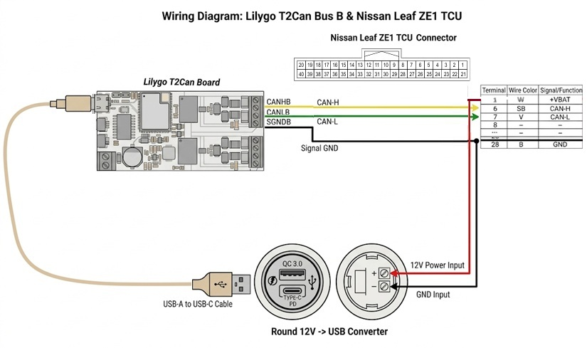
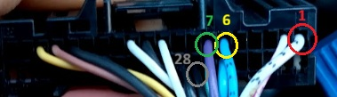
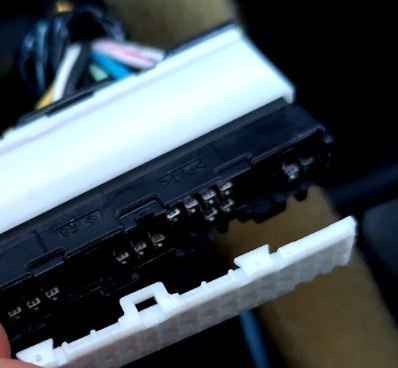

# Installation Guide

## Wiring Diagram

## Required tools and accessories
* Cross screwdriver (for removing glove box)
* Unpinning tool (e.g. very small flat screwdriver)
* Crimping tool or pliers (to crimp the new connector pins)
* 16 Pin Sumitomo NH .025″ or similar connector housing set for connectors on both sides. (e.g. [Eastern Beaver 16-pin connector](https://www.easternbeaver.com/product/16-pin-sumitomo-nh-025-connector/))
* 12V to USB supply converter. (example: [Motonet USB socket](https://www.motonet.fi/tuote/four-vedenpitava-usb-pistorasia-12-24-v?product=65-01122))
* USB A to USB C cable (for powering the LilyGo)

## Recommended installation steps

1. **Prepare the CAN wires:**

   1.1. Crimp NH .025" male pins to the other end of the CAN and signal GND wires and screw the open ends to the screw connectors at the Lilygo board CAN terminal B.

   1.2. Create splitting supply wires for 12V and GND to the USB power converter and old TCU by joining cables by crimping or soldering. 12V supply should have 3 ends and GND should have 4 ends: (female NH .025", male NH .025", and open ends for the voltage converter and signal ground wires).

   1.3. Connect the open ended supply wires to the 12V->USB supply converter. Leave the NH .025" pin ends unconnected for now.

2. **Remove negative 12V battery terminal:**

   2.1. Before removing terminal: Turn power on and off. Close doors. Wait for 5 mins to let the car go to sleep.

   2.2. Remove the negative terminal.

3. **Remove Glovebox:** (See [video reference for LHD ZE1 Leaf](https://youtu.be/kyx2A4U-M1M?si=YGewj1TeBEfrpOKV))

4. **Remove TCU and detach its 40-pin connector.**

5. **Unpin the required pins (1, 6, 7, 28) from TCU connector:**

   

   5.1. Remove the connector cover cap (end at opposite side of wires).

   

   5.2. Release the connector lock (at the connector side).

   5.3. Use an unpinning tool to release the pin and pull it from the connector.

6. **Push the unpinned pins to the new NH .025″ Female Connector Housing:**
   *Suggestion:* Use the same pin numbering as the standard OBD2 connectors for possibility for easy adaptation later. Remember to release the connector locking mechanism.

7. **Push the supply and CAN wire pins prepared in step one to the corresponding location in the new NH .025" male connector housing.**

8. **Push the other ends of supply wires to the existing TCU Female connector (corresponding locations (pins 1, 28) that were unpinned in step 5).**

9. **Position LilyGo T-2CAN board in box in a suitable location.** (e.g. behind the glove box or in the glove box. There is a hatch at the side of the glove box that can be used for easy wire routing.)

10. **Double check all connections.**

11. **Install back the TCU and glove box. Connect negative 12V battery terminal.**

12. **Connect USB cable to PC and flash the LilyGo T-2CAN board with Arduino IDE.**
    After flashing, open the Serial Monitor (at 115200 baud) to configure your Wi-Fi and MQTT settings (e.g., type `set ssid MyWiFi` and `reboot` - see README for all commands).

13. **Connect USB cable to the 12V converter in the car to power the LilyGo.**
