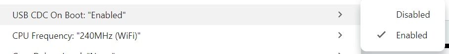

# Compiling and Flashing Firmware

## Compiling and Uploading with Arduino IDE

To compile and upload the firmware for the Lilygo T-2CAN board using the Arduino IDE, please configure the following settings:

1. **Board Selection**: Select **ESP32S3 Dev Module** as your target board.
   * If you haven't set up the ESP32 core yet, please follow the [LilyGO T-2CAN Quick Start Guide](https://wiki.lilygo.cc/get_started/en/High_speed/T-2Can/T-2Can.html#Quick-Start) to download the required board files.
   
   

2. **Serial Output Configuration**: **USB CDC On Boot** needs to be set to **"Enabled"** for the printouts to appear in the Serial Monitor.
   
   

## Compiling and Uploading with Arduino CLI

If you prefer using the command line, you can build and flash the firmware using the [Arduino CLI](https://arduino.github.io/arduino-cli/).

1. **Install the ESP32 core and required libraries**:
   ```bash
   arduino-cli core update-index --additional-urls https://espressif.github.io/arduino-esp32/package_esp32_index.json
   arduino-cli core install esp32:esp32 --additional-urls https://espressif.github.io/arduino-esp32/package_esp32_index.json
   arduino-cli lib install PubSubClient
   ```

2. **Compile the sketch** (ensuring USB CDC On Boot is enabled):
   ```bash
   arduino-cli compile --fqbn esp32:esp32:esp32s3:CDCOnBoot=cdc simppeliTCU
   ```

3. **Upload to the board** (replace `<PORT>` with your COM port, e.g., `COM3` or `/dev/cu.usbserial...`):
   ```bash
   arduino-cli upload -p <PORT> --fqbn esp32:esp32:esp32s3:CDCOnBoot=cdc simppeliTCU
   ```