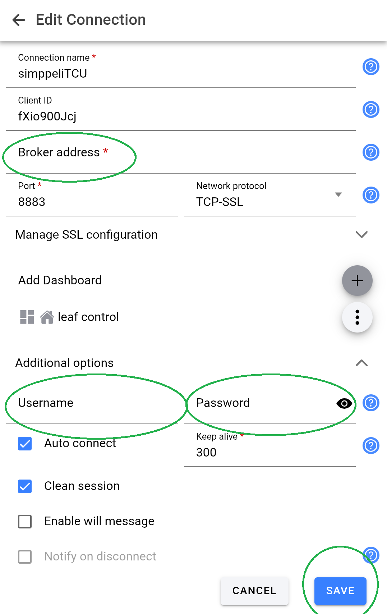
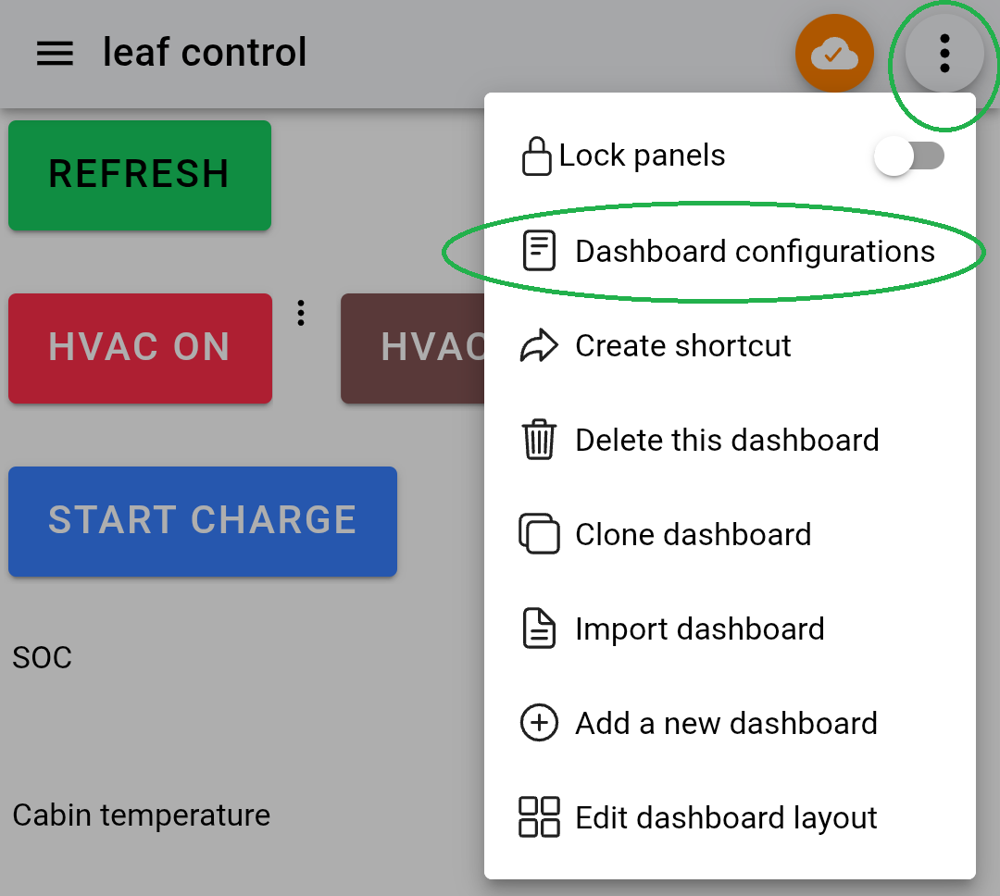
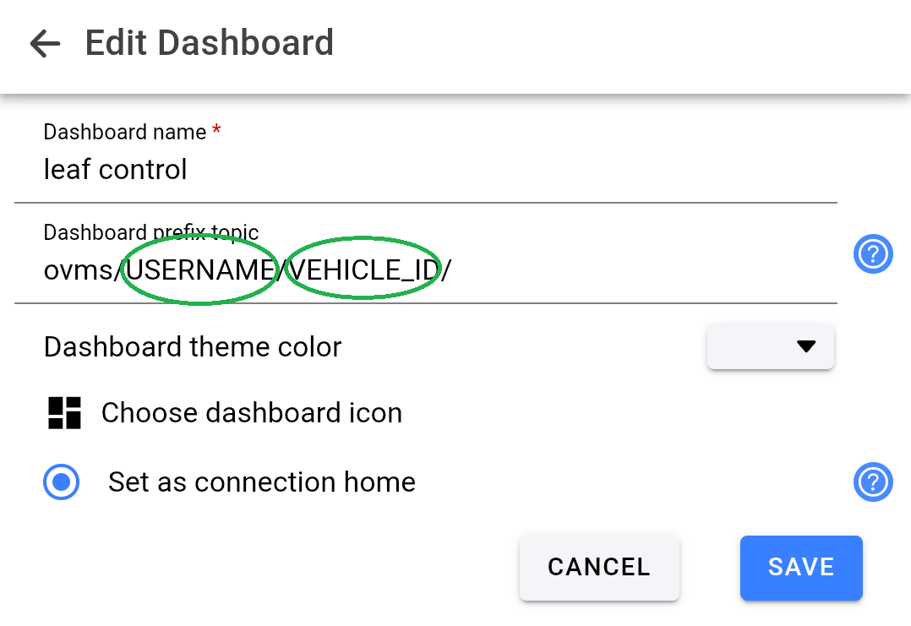

# MQTT Setup and Configuration

This guide provides instructions on setting up simppeliTCU with an MQTT broker using username and password authentication, as well as configuring the IoT MQTT Panel app for mobile control.

## 1. Prerequisites and Network Environment

simppeliTCU requires network connectivity to the configured MQTT broker to publish and subscribe to messages.
If your broker is hosted on the internet, you can provide this connectivity using an internet-capable WiFi hotspot device or a dedicated mobile router. If your broker runs on the local LAN, internet access is not required as long as simppeliTCU can reach the broker over the network. A practical and cost-effective example is to use an old mobile phone left in the car, configured to broadcast a WiFi hotspot.

## 2. Choosing an MQTT Broker

Your device will communicate with an MQTT broker. You must configure the broker with username and password authentication for security.

If you don't already host your own MQTT broker, there are several cloud providers that offer free plans which are excellent for testing authenticated MQTT communication:
- **[HiveMQ](https://www.hivemq.com/mqtt-cloud-broker/)**
- **[MyQttHub.com](https://myqtthub.com/)**

Follow your chosen provider's documentation to create an account, obtain your broker URL, and set up your username and password.

> [!WARNING]
> The firmware currently uses TLS for MQTT transport, but by default it does **not** verify the broker's server certificate (`espClient.setInsecure()` is used). This means the connection is encrypted, but it does not authenticate the server, so it is still vulnerable to man-in-the-middle attacks.
>
> For this reason, only use this default setup with a broker you trust, ideally on a trusted local network or through a trusted VPN. For stronger security, update the firmware to validate the broker certificate using a CA certificate or certificate pinning instead of using `setInsecure()`.

## 3. IoT MQTT Panel App Configuration

You can use the **IoT MQTT Panel** Android app to control your vehicle and view telemetry. We have provided a ready-to-use button layout and dashboard configuration.

Check out the demonstration video: **[MQTT use with IoTMQTTPanel and OVMS Connect](https://youtu.be/g8Yh6OgjL-Q?si=QtElrzG9FnF5YEUm)**

### Importing the Dashboard

1. Locate the `IoTMQTTPanel-simppeliTCU.json` file in the `docs/` folder of this repository.
2. Transfer this file to your Android device.
3. Open the IoT MQTT Panel app.
4. Tap the menu in the top left corner, select **Backup and Restore**, and then choose **Restore**. Select the JSON file you transferred.

> [!NOTE]
> The `IoTMQTTPanel-simppeliTCU.json` configuration has the "allow untrusted certificates" option active by default. Since simppeliTCU itself currently uses `setInsecure()` and does not enforce certificate checking, mandating certificates in the app alone does not significantly increase overall system security until the simppeliTCU firmware is also modified to verify them. However, you can choose to enable the certificate check in the app's connection settings later if desired.

### Configuring the Connection

Once the dashboard is imported, you must update the connection details to point to your MQTT broker:

1. Open the imported connection settings.
2. Enter your broker's URL in the **Broker address** field.
3. Enter your broker credentials in the **Username** and **Password** fields.
4. Ensure the port is correctly set (usually `8883` for secure TCP-SSL).
5. Tap **SAVE**.

*(Fill in Broker address, Username, and Password)*

### Updating the Topic Prefix

The panels in the app rely on a base topic prefix to communicate with the specific vehicle.

1. Go to edit the imported dashboard (e.g., "leaf control").
2. Find the **Dashboard prefix topic** field.
3. The default template is `ovms/USERNAME/VEHICLE_ID/`. You need to replace `USERNAME` with your MQTT username and `VEHICLE_ID` with the vehicle ID you have flashed/configured in your simppeliTCU.
4. Tap **SAVE**.

*(Open dashboard menu)*

*(Update the Dashboard prefix topic)*

Once saved and connected, you should be able to see valid data on your dashboard and control the vehicle state!

---

## 4. MQTT API Reference

simppeliTCU aims to follow OVMS V.3 topic structure where possible.
A small subset of topics has been implemented.

### Topic Structure
All topics use the base prefix `ovms/<user>/<vehicle>/`

Where:
- `<user>` = MQTT username configured in simppeliTCU
- `<vehicle>` = Vehicle ID configured in simppeliTCU

### Published Topics (simppeliTCU → Broker)

| Topic | Retained | Description |
|-------|----------|-------------|
| `ovms/<user>/<vehicle>/metric/v/b/soc` | Yes | State of Charge percentage as decimal string (e.g., `75.5`) |
| `ovms/<user>/<vehicle>/metric/v/e/cabintemp` | Yes | Cabin temperature in °C as decimal string (e.g., `22.5`) |
| `ovms/<user>/<vehicle>/metric/v/c/charging` | Yes | Charging status: `yes` or `no` |
| `ovms/<user>/<vehicle>/metric/v/c/state` | Yes | Charging state: `charging`, `done`, `stopped`, `wait`, or empty |
| `ovms/<user>/<vehicle>/metric/v/e/hvac` | Yes | HVAC status: `yes` or `no` |
| `ovms/<user>/<vehicle>/metric/v/d/fl` | Yes | Front left door open: `yes` or `no` |
| `ovms/<user>/<vehicle>/metric/v/d/fr` | Yes | Front right door open: `yes` or `no` |
| `ovms/<user>/<vehicle>/metric/v/d/rl` | Yes | Rear left door open: `yes` or `no` |
| `ovms/<user>/<vehicle>/metric/v/d/rr` | Yes | Rear right door open: `yes` or `no` |
| `ovms/<user>/<vehicle>/metric/v/d/trunk` | Yes | Trunk open: `yes` or `no` |
| `ovms/<user>/<vehicle>/metric/v/e/locked` | Yes | Vehicle locked: `yes` or `no` |
| `ovms/<user>/<vehicle>/metric/s/v3/connected` | Yes | Connection status (LWT): `yes` or `no` |
| `ovms/<user>/<vehicle>/client/<clientid>/response/<commandid>` | No | Response to specific commands. |

### Subscribed Topics (simppeliTCU ← Broker)

| Topic | Description |
|-------|-------------|
| `ovms/<user>/<vehicle>/client/<clientid>/command/<commandid>` | Commands from OVMS app. `<clientid>` and `<commandid>` can be any identifier. |

#### Supported Commands

| Command | Action |
|---------|--------|
| `climatecontrol on` | Triggers `handleMqttHvacOn()` |
| `climatecontrol off` | Triggers `handleMqttHvacOff()` |
| `charge start` | Triggers `handleMqttChargeOn()` |
| `lock <pin>` | Triggers `handleMqttLock()` (PIN is optional and ignored) |
| `unlock <pin>` | Triggers `handleMqttUnlock()` (PIN is optional and ignored) |
| `server v3 update modified` | Triggers `handleMqttRefresh()`, returns current SOC and cabin temp |
